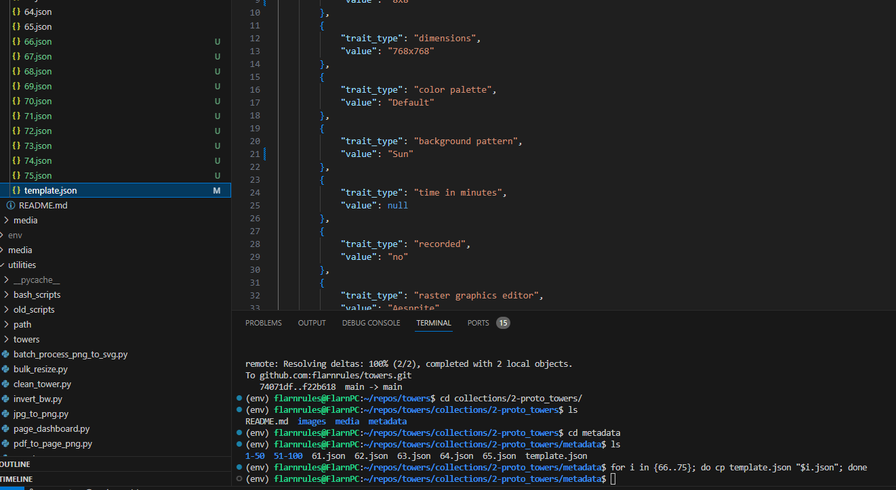

#################
# PROTO TOWERS ##
#################

This is proto towers. a multimedia collection of proto towers, minted as IPFS links and metadata hosted on the Stargaze blockchain.

Proto towers is important, because it is the beginning.

>Proto ~ < insert definition here >

>Tower ~ < insert definition here >

What do we have in this directory right now?
Hey how do I use Obsidian to make this work better...

This is an exercise in learning how to develop little ways to automate the boring stuff.

And just... get right into the interesting stuff.
But sometimes *building* the tools to get there is more interesting than the origin *or* destination.

########################
# DIRECTORY STRUCTURE ##
########################

Structure works like this.

The repo name is Towers, there are 4 subdirectories.

1. collections
2. media
3. utilities
4. web_stuff

I only really know what's in collections and utilities right now. I've basically forgotten what's inside web_stuff entirely, and media probably has some original drawings or generated pieces of art for the main collection. 

Speaking of that... I should probably also use those pieces as Proto Towers, as long as I know for sure they aren't gonna be minted in the main collection, or modify them in some way. This could make it easy to mint one on a day where perhaps I'm too busy to do a bunch of art, I could just run some special command and it mints from a big pile of old concept art at random. That would be really cool.


#################################
# metadata naming standards
#################################

The metadata is stored in a `json` file located in the `metadata` subdirectory. The overall structure of the json is like this:

```JSON
{
    "name":"Proto Tower <number>",
    "description":"Any description.",
    "attributes": [
        {
            "trait_type": "trait name",
            "value": "Value" 
        },
        {
            "trait_type": "other trait name",
            "value": "Some Other Value"
        }
    ]
}
```
Make note of two key formatting choices:
- `trait_type`s are all lower case.
- `value`s are all upper case, all first letters are uppercase!
- some of the older items in this collection do not follow these standards, which I think can be rectified with a bit of effort on Stargaze Studio.

A note on the name "Proto Tower <number>" -> this is not super optimal for sorting, should have probably gone with 1, 2, 3 etc. But can't change it now, so let's roll with it. One issue that came up is that I had to burn a faulty nft early on, and thus the incrementing token id on stargaze is off by 1 unit. Thus, I'm going to skip the name `Proto Tower 87` and that should sort out the sequencing issue.

#################################
# types of deployment
#################################

Standard
Blitz
Series
Collab
1/1


## Standard 
- i mint and list 5 towers, all of the same dimensions, and sometimes following similar thematic elements. the decision for what to do currently is literally whatever comes to my head first. i could eventually standardize this process a bit, like demonstrate certain holidays or special occasions result in topically significant choices in the designs. That would be really cool. (only type as of proto tower 65.)

To setup a standard - run `.\standard_setup.sh` in the correct folder ( think `towers/collections/2-proto_towers/`) and follow the command line interface prompts.


## 8x8 Blitz
 - i mint and list 10 towers, all of them 8x8 dimensions. the metadata is typically copied from previous blitz'z and basically there's only 64 squares to work with so it's kind of challenging to draw anything of substance. (never been done)

others - to be determined

blitz steps:

1. First, you need to be in the `towers/collections/2-proto_towers/metadata` directory.

2. Then, you need to navigate to `template.json` and make changes based on the base template you want.

3. Then once you feel ready, you need to know the starting id number and ending id number for the nfts you are going to drop.

4. Then you run the following in the command line: `for i in {66..75}; do cp template.json "$i.json"; done` and you will get 10 freshly created <number.json> files.
. I'm so used to obsidian, i actually have no idea how real markdown works.

I need to do some research so these docs don't suck ass.

Anyways.

5. If the command was configured correctly, you'll have 10 new metadata files, you still need to *manually* go in and change each "name" to the correct <Proto Tower Number> which is a pain. This could be fixed with a bit more automation in that script above, but at this time it feels easier to just manually go and change the names than to use my brain to figure out how to code that automation into the script. The funny Thing I find about software development is that... I don't have the basics down, so doing something as simple as adding another, slightly more complex `for` loop in the above BASH script is actually a huge and annoying task. a chore, rather than a mere inconvenience like flipping a light switch... I digress.

Anyways, after you get all of the metadata files with the correct "name" inside each JSON, you are ready for the next step.

6. Draw 10 8x8 towers. Just do whatever you want, as long as it is a tower. with 8x8 there's really not a whole lot of real estate, so it's kind of interesting the amount of restriction you have means it's super easy to just, draw a simple tower in 5 seconds. The tower needs a background pattern. so far ive only used the `sun` background pattern, but it's possible more patterns could emerge. for blitz'z it's best to not think about it, as that takes time.

6a --> this is an overlooked step. not the drawing itself, but the necessary setup. need to have access to a computer or a phone with pixel art software. thankfully MS Paint is a perfectly passable raster graphics software, but Aesprite is my personal favorite. If I have access to Aesprite and a drawing pad, I can create the coolest shit. Anyways, to get set up, you need to copy an aesprite file with an 8x8 canvas size 10 times to save time transition from 1 drawing to the next. this will increase the chances of entering into a flow state, and *generating* some really interesting art.

6b --> I need to write a script that does this for me. Should be relatively simple to do. I'll use a crane (🏗️) emoji to indicate things that need to be built: 🏗️. If you are a new developer or just reading through this, quick tip about emojis... if you are on windows you can access the emoji menu with: `windows key + .` -> that's Windows Key and Period at the same time. It's quite remarkable, having the emoji menu right at your fingertips. Just like... hundreds of well designed tiny representations of important concepts. emojis are actually pretty cool come to think of it... anyways... 🏗️ for good measure, this would be really helpful. and save a lot of tedium.


## collab
mint and list 1 tower that is a collab with another artist.
List is always as an auction starting at the tower's number + 10 stars.
Auction length is variable, anywhere from 6 hours to several days.

###############################################
# collaborations
###############################################

All collaborations are welcome.

Collaborators need to provide:
- a pixel drawing of a tower (any dimensions, but must be a square - common dimensions are 8x8, 16x16, 32x32, 64x64, 128x128, but you can do whatever size you want!), in any suitable format (png, jpeg, gif) or even some exotic stuff like .svg (but we will need to chat how to make non simple raster graphics work)
- a description, this will go in the metadata under "description"
- a color palette, this will go in the metadata under "color palette"
- a background pattern, this will go in the metadata under "background pattern"

Optionally, collaborators can provide more information to enhance the nft's story:
- additional custom meta data: trait type name + trait value.
- preferred collab artist name.
- preferred collab collection name.
- preferred auction length.
- a wallet address to receive royalties from the `proto towers master` wallet.

I can do the rest.
Reach out to me on twitter (@flarnrules1) or Discord(@flarnrules).

Current collaborations include:
1. Proto Tower 81 "Wadbot ProtoTower" - by Captain Jinxto
2. Proto Tower 88 "Tower of Maintis ProtoTower" - by Captain Jinxto

## collab royalties tracking
proto towers master wallet:
stars1hyhmssn4j6fxlvq58ctlpxwg5az7shg7zc77rp
current memo: `for collab 🏙️🌆`

collaborator wallets:
stars1mqypstgwxah7mnw2dqh25g9f3qq55zg9g9650z

x=x=x=x=x=x=x=x=x=x=x=x=x=x=x=x=x=x=x=x=x
1/2/2024 - wallet contents = 805 STARS
collaborations
Jinxto - 2 100%
Total - 2 100%

Split - 25% stake, 25% liquid, 50% to collaborators
25% x 805 = 201.25 Staked
25% x 805 = 201.25 Liquid
50% x 805 = 402.5 Collaborators

Next split on 1/9/2024
memo: for collab 🏙️🌆
x=x=x=x=x=x=x=x=x=x=x=x=x=x=x=x=x=x=x=x=x

##################################
# technical stuff
##################################
upscale calculations for 768x768 dimensions
8x8 =>
16x16 => 4800%
32x32 =>
64x64 =>
128x128 =>

###################################
# prizes
###################################

Sometimes there will be prizes for people who answer questions based on descriptions in the Proto Towers.
Prizes can be anything I want to give at the time. Usually will be nfts from my personal collection.
All prize winners at minimum earn a whitelist spot. I'll track the whitelist spots from prizes here (for now).
Prizes will be limited to a number of individuals. Usually 5 or 10.

The first one was a Gas Giant consuming the earth.
10 winners.

1. @ajk_ajk - 
2. 

